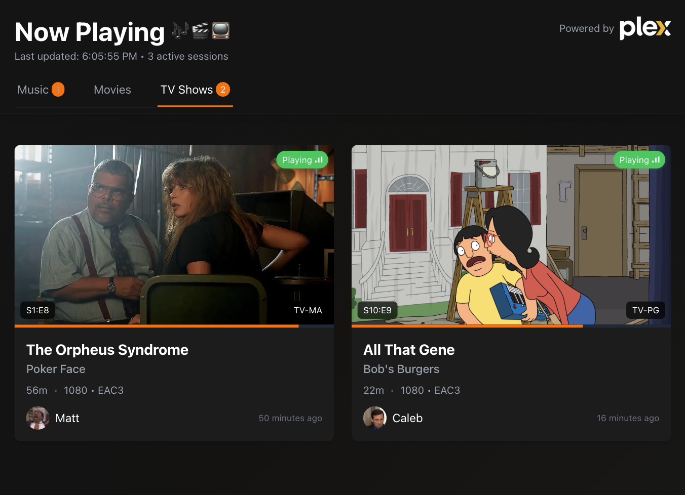
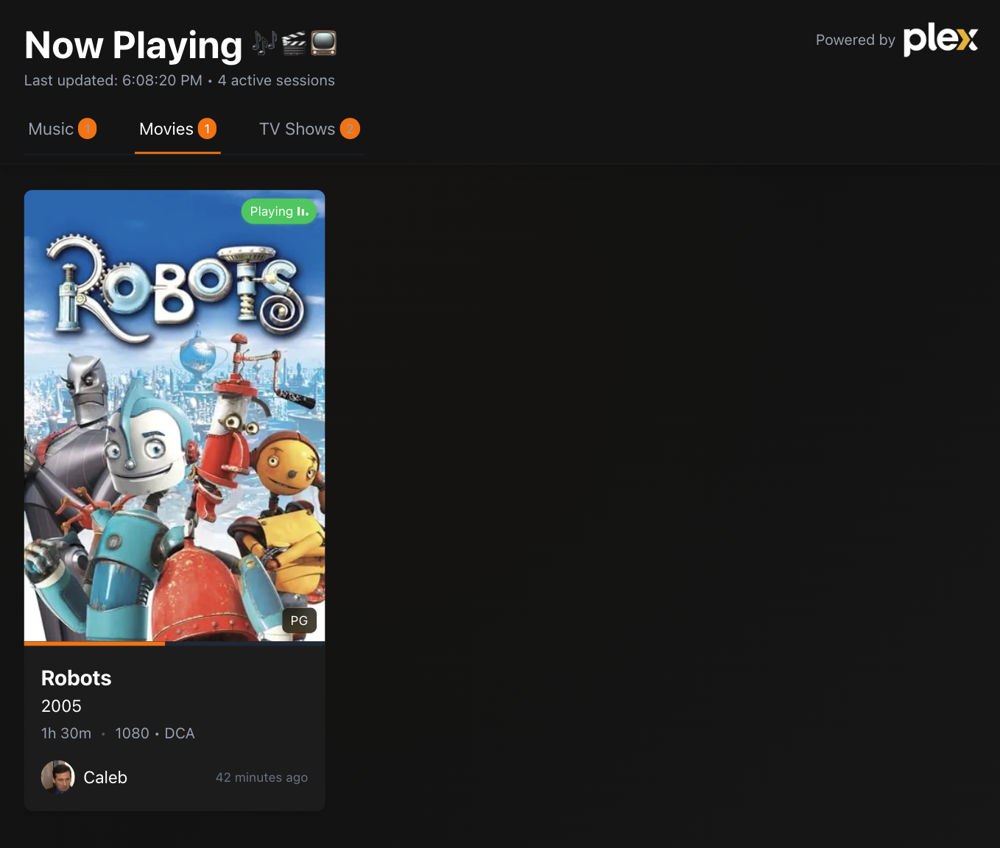
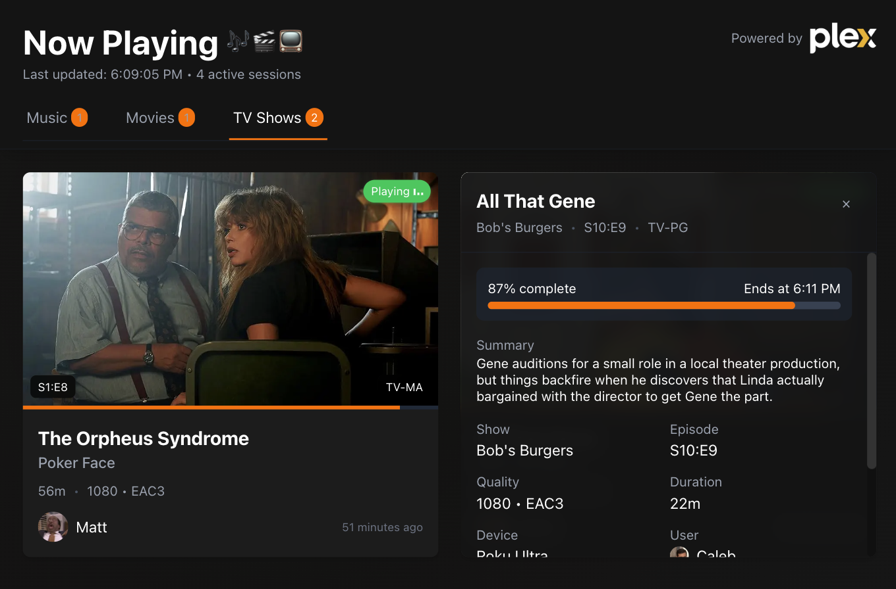
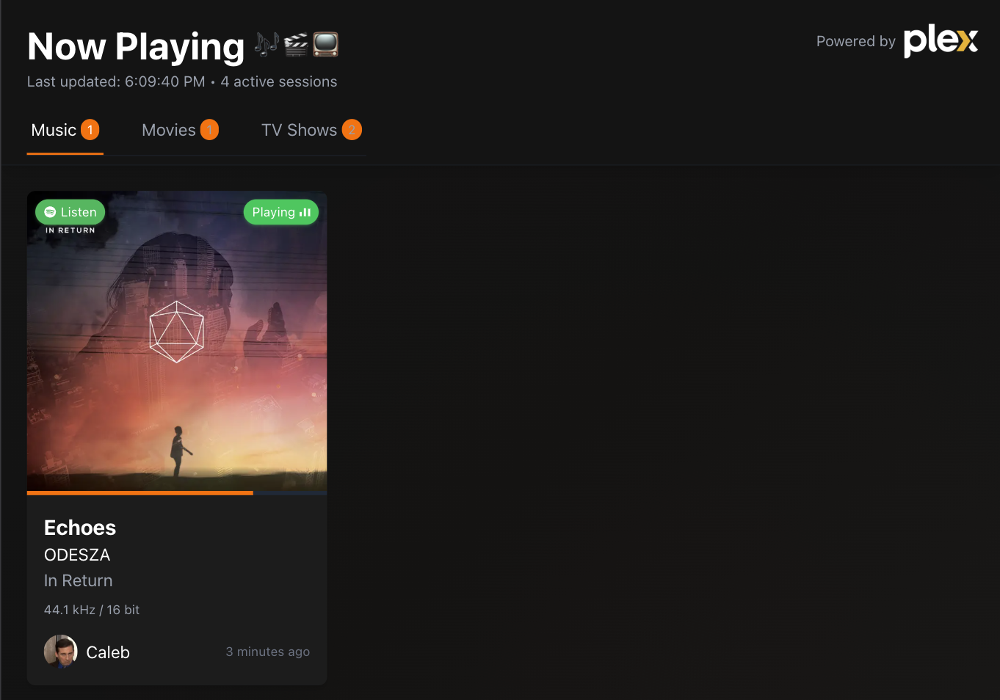
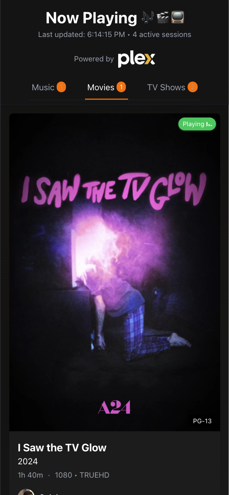
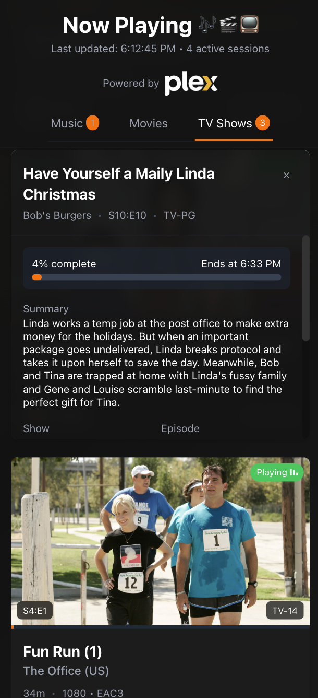
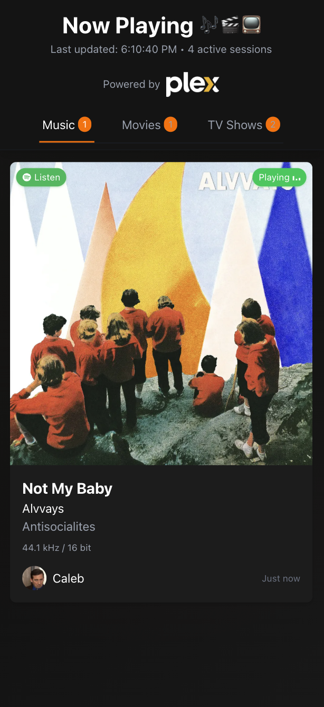
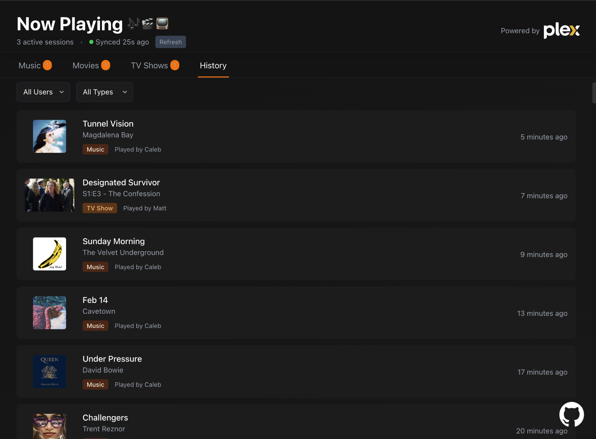

# Now Playing: A Plex Dashboard

A sleek, real-time dashboard to monitor and display media currently streaming on your Plex server. This application provides a modern interface showing what's playing right now across music, movies, and TV shows, along with viewing history.



## Features

- **Real-time Monitoring**: See what's currently playing on your Plex server with automatic updates
- **Multi-format Support**: Tracks movies, TV shows, and music streams
- **Viewing History**: Browse through past watch activity with filtering by user and media type
- **Detailed Media Cards**: Rich information including progress, quality, user data, and more
- **Media Details**: In-depth information on each media item with expandable details view
- **Transcode Progress**: Live monitoring of transcoding status and progress
- **Responsive Design**: Optimized viewing experience on mobile and desktop devices with swipe navigation
- **Adaptive Polling**: Smart polling that adjusts frequency based on media playback state and user activity
- **Connection Management**: Automatic reconnection and status monitoring for reliable operation
- **Spotify Integration**: Direct links to music tracks on Spotify
- **Animated UI**: Smooth transitions and loading states using Framer Motion
- **Docker Deployment**: Simple deployment with containerization

## Screenshots

| Movies                                | TV Shows                            | Music                               |
| ------------------------------------- | ----------------------------------- | ----------------------------------- |
|  |  |  |

_Mobile Views_

| Movies                                   | TV Shows                               | Music                                  |
| ---------------------------------------- | -------------------------------------- | -------------------------------------- |
|  |  |  |

| History                             |
| ----------------------------------- |
|  |

## Tech Stack

- **Frontend**: Next.js 15, React 19, TypeScript
- **Styling**: Tailwind CSS 4
- **Animations**: Framer Motion
- **State Management**: React Context API
- **Gesture Support**: react-swipeable
- **Containerization**: Docker
- **APIs**: Plex API, Spotify API

## Prerequisites

- Node.js 20+
- Docker and Docker Compose (for containerized deployment)
- Plex server with a valid token
- Spotify Developer credentials (for music integration)

## Setup and Installation

### Local Development

1. Clone the repository:

   ```bash
   git clone https://github.com/caleb-vanlue/now-playing.git
   cd now-playing
   ```

2. Install dependencies:

   ```bash
   npm install
   ```

3. Create a `.env` file in the root directory with the following variables:

   ```
   PLEX_URL=your_plex_server_url
   PLEX_TOKEN=your_plex_token
   FETCH_TIMEOUT=8000
   SPOTIFY_CLIENT_ID=your_spotify_client_id
   SPOTIFY_CLIENT_SECRET=your_spotify_client_secret
   ```

4. Run the development server:

   ```bash
   npm run dev
   ```

5. Open [http://localhost:3000](http://localhost:3000) in your browser.

### Docker Deployment

1. Ensure Docker and Docker Compose are installed.

2. Build and run the container:

   ```bash
   docker-compose up -d
   ```

3. Access the dashboard at [http://localhost:3003](http://localhost:3003).

## Configuration

### Environment Variables

| Variable                | Description                         | Default    |
| ----------------------- | ----------------------------------- | ---------- |
| `PLEX_URL`              | URL of your Plex server             | (Required) |
| `PLEX_TOKEN`            | Authentication token for Plex API   | (Required) |
| `FETCH_TIMEOUT`         | Timeout for API requests (ms)       | 8000       |
| `SPOTIFY_CLIENT_ID`     | Spotify Developer API Client ID     | (Optional) |
| `SPOTIFY_CLIENT_SECRET` | Spotify Developer API Client Secret | (Optional) |

### Obtaining a Plex Token

1. Log in to your Plex account on the web
2. Navigate to any media item and inspect the network requests
3. Look for an `X-Plex-Token` parameter in the requests
4. Use this value as your `PLEX_TOKEN`

### Setting Up Spotify Integration

1. Create a Spotify Developer account at [https://developer.spotify.com/](https://developer.spotify.com/)
2. Create a new application in the Spotify Developer Dashboard
3. Note the Client ID and Client Secret
4. Add these values to your environment variables

## API Endpoints

The dashboard automatically communicates with your Plex server. If you need direct access to the API, the following endpoints are available:

- `/api/plex/sessions` - Get currently playing sessions
- `/api/plex/history` - Get viewing history
- `/api/plex/thumbnail` - Get media thumbnails
- `/api/spotify/search` - Search for tracks on Spotify

## Performance Optimizations

- **Adaptive Polling**: Polling frequency adjusts based on playback state and user activity
- **Lazy Loading**: Images and components load only when needed
- **Optimized Rendering**: React memo and hooks optimize rendering performance
- **Responsive Assets**: Images are served at appropriate sizes for different devices

## Acknowledgments

- Plex for their amazing media server
- Spotify for their music API
- All the open-source libraries used in this project
