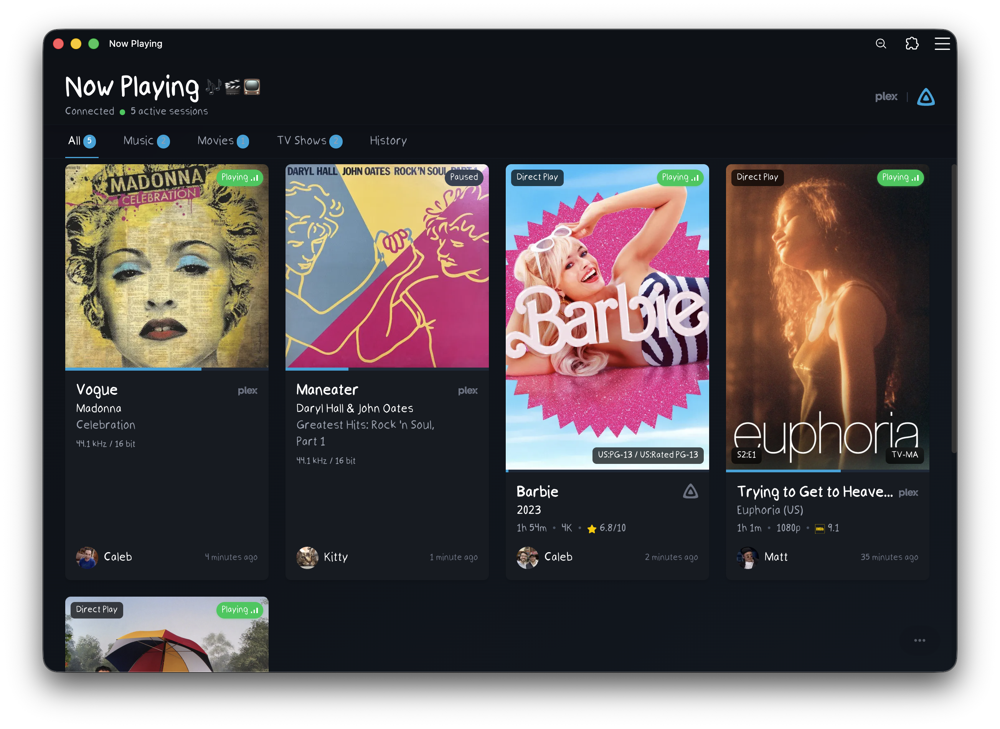
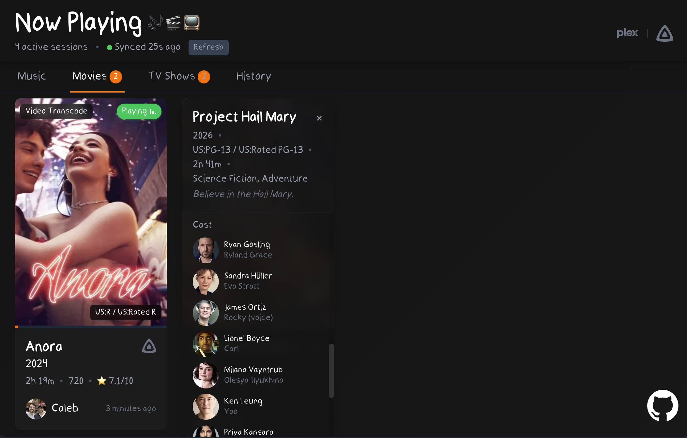
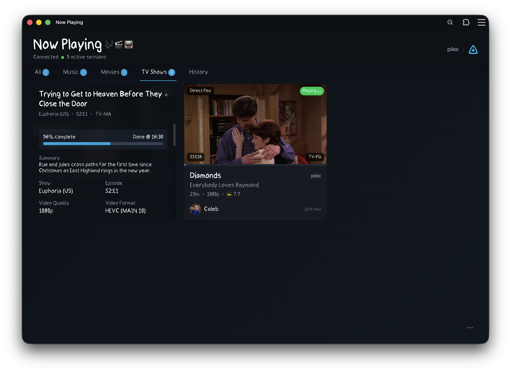
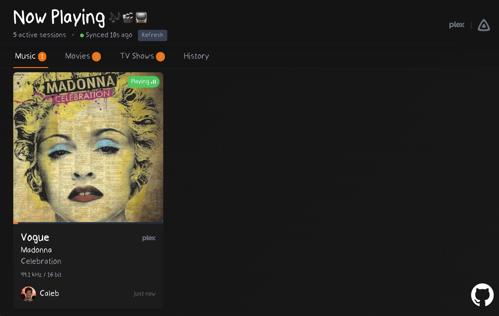
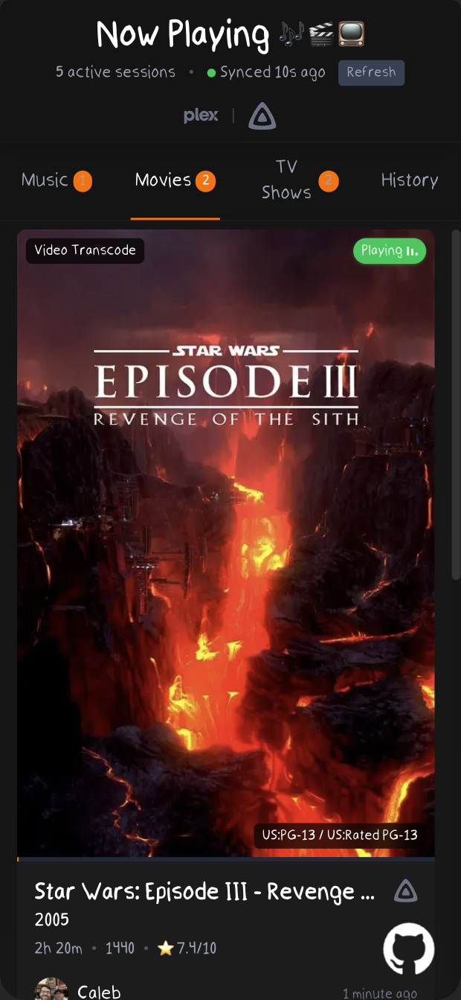
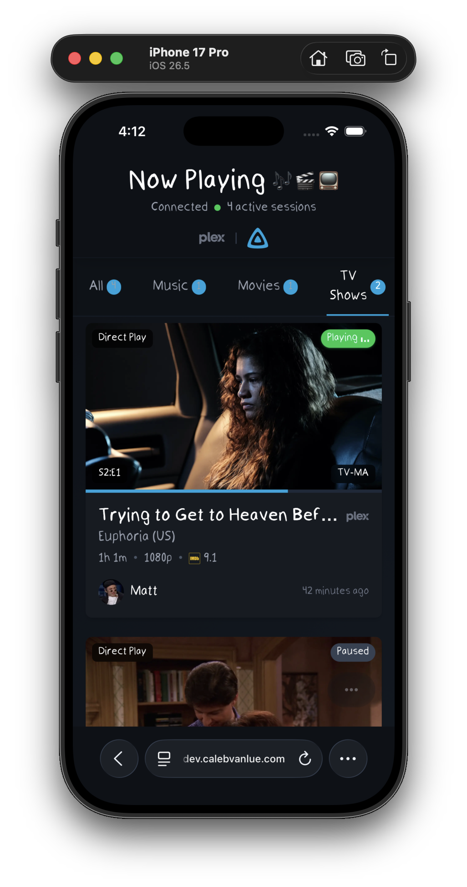
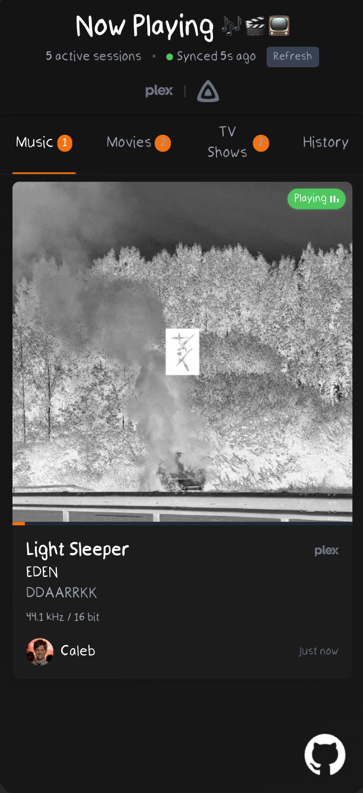
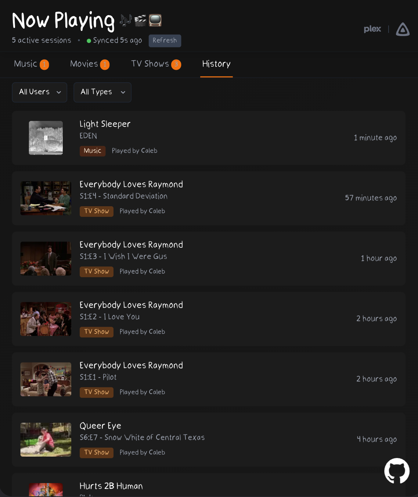

# Now Playing

A sleek, real-time dashboard for monitoring media playback across your self-hosted streaming servers. Supports **Plex** and **Jellyfin** — configure one or both, and sessions and history are merged automatically into a single view.



## Features

- **Multi-service support**: Works with Plex and Jellyfin simultaneously — sessions and history are pooled and sorted together
- **Real-time monitoring**: See what's currently playing with automatic adaptive polling
- **Multi-format support**: Tracks movies, TV shows, and music streams
- **Viewing history**: Browse past watch activity with filtering by user and media type
- **Rich media cards**: Progress, quality, transcode status, cast, genres, ratings, and more — expandable detail view per card
- **Responsive design**: Optimized for mobile and desktop with swipe navigation
- **Adaptive polling**: Adjusts update frequency based on playback state and user activity
- **Spotify integration**: Direct links to music tracks on Spotify (requires Premium as of Feb 2026)
- **Animated UI**: Smooth transitions and loading states via Framer Motion
- **Docker deployment**: Simple containerized deployment

## Screenshots

| Movies                                | TV Shows                            | Music                               |
| ------------------------------------- | ----------------------------------- | ----------------------------------- |
|  |  |  |

_Mobile Views_

| Movies                                   | TV Shows                               | Music                                  |
| ---------------------------------------- | -------------------------------------- | -------------------------------------- |
|  |  |  |

| History                             |
| ----------------------------------- |
|  |

## Tech Stack

- **Frontend**: Next.js 15, React 19, TypeScript
- **Styling**: Tailwind CSS 4
- **Animations**: Framer Motion
- **State Management**: React Context API
- **Gesture Support**: react-swipeable
- **Icons**: react-icons (Simple Icons)
- **Containerization**: Docker
- **APIs**: Plex API, Jellyfin API, Spotify API

## Prerequisites

- Node.js 20+
- Docker and Docker Compose (for containerized deployment)
- A running Plex and/or Jellyfin server
- Spotify Developer credentials (optional, for music integration)

## Setup and Installation

### Local Development

1. Clone the repository:

   ```bash
   git clone https://github.com/caleb-vanlue/now-playing.git
   cd now-playing
   ```

2. Install dependencies:

   ```bash
   npm install
   ```

3. Copy the example env file and fill in your values:

   ```bash
   cp .env.example .env
   ```

   See [Configuration](#configuration) below for details on each variable.

4. Run the development server:

   ```bash
   npm run dev
   ```

5. Open [http://localhost:3000](http://localhost:3000) in your browser.

### Docker Deployment

1. Ensure Docker and Docker Compose are installed.

2. Copy and configure your environment:

   ```bash
   cp .env.example .env
   # edit .env with your values
   ```

3. Build and run:

   ```bash
   docker-compose up -d
   ```

4. Access the dashboard at [http://localhost:3003](http://localhost:3003).

## Configuration

Copy `.env.example` to `.env`. At least one of Plex or Jellyfin must be configured — both can be active at the same time.

### Environment Variables

| Variable                  | Description                                      | Required          |
| ------------------------- | ------------------------------------------------ | ----------------- |
| `PLEX_URL`                | Full URL of your Plex server (with port)         | If using Plex     |
| `PLEX_TOKEN`              | Plex authentication token                        | If using Plex     |
| `JELLYFIN_URL`            | Full URL of your Jellyfin server (with port)     | If using Jellyfin |
| `JELLYFIN_API_KEY`        | Jellyfin API key (admin privileges required)     | If using Jellyfin |
| `SPOTIFY_CLIENT_ID`       | Spotify Developer app Client ID                  | Optional          |
| `SPOTIFY_CLIENT_SECRET`   | Spotify Developer app Client Secret              | Optional          |
| `NEXT_PUBLIC_FETCH_TIMEOUT` | Upstream API request timeout in ms             | Optional (8000)   |

### Obtaining a Plex Token

1. Open Plex Web and navigate to any media item
2. Click ⋮ → "Get Info" → "View XML"
3. Copy the `X-Plex-Token` value from the URL

Full instructions: [support.plex.tv/articles/204059436](https://support.plex.tv/articles/204059436)

### Obtaining a Jellyfin API Key

1. Open the Jellyfin admin dashboard
2. Go to **Administration → API Keys → +**
3. Give it a name (e.g. "Now Playing") and save
4. The key needs admin-level access to list all users' playback history

### Setting Up Spotify Integration

> **Note:** As of Feb 2026 this feature requires a Spotify Premium account.

1. Create an app at [developer.spotify.com/dashboard](https://developer.spotify.com/dashboard)
2. Copy the Client ID and Client Secret into your `.env`

## API Endpoints

| Endpoint                    | Description                          |
| --------------------------- | ------------------------------------ |
| `/api/plex/sessions`        | Active Plex sessions                 |
| `/api/plex/history`         | Plex viewing history                 |
| `/api/plex/thumbnail`       | Proxied Plex media thumbnails        |
| `/api/jellyfin/sessions`    | Active Jellyfin sessions (enriched with item detail) |
| `/api/jellyfin/history`     | Jellyfin playback history (all users) |
| `/api/jellyfin/thumbnail`   | Proxied Jellyfin media thumbnails    |
| `/api/spotify/search`       | Spotify track search                 |

## Acknowledgments

- [Plex](https://www.plex.tv) for their media server platform
- [Jellyfin](https://jellyfin.org) for the open-source media server
- [Spotify](https://developer.spotify.com) for their music API
- All the open-source libraries that make this possible
