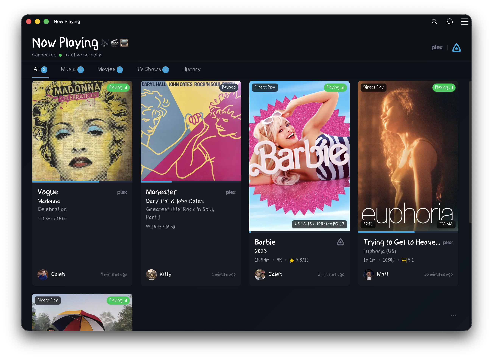
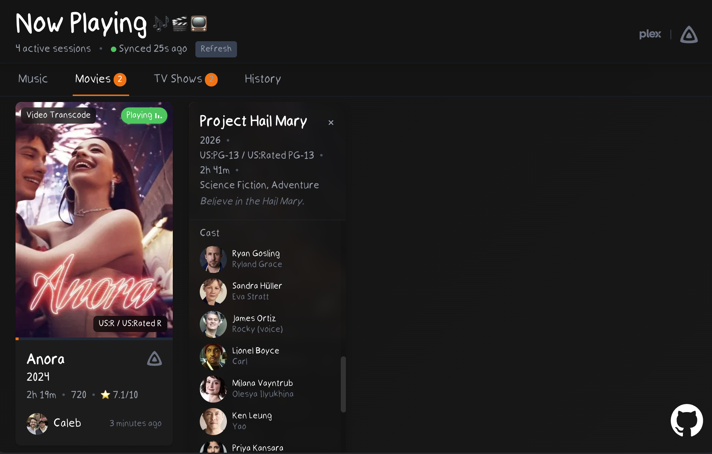
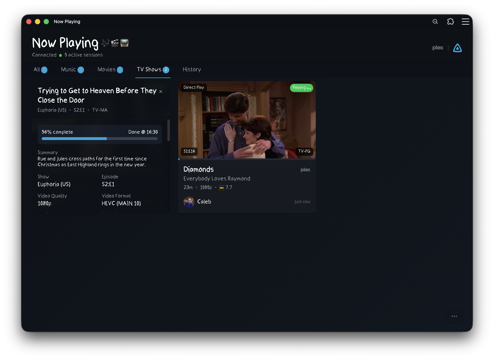
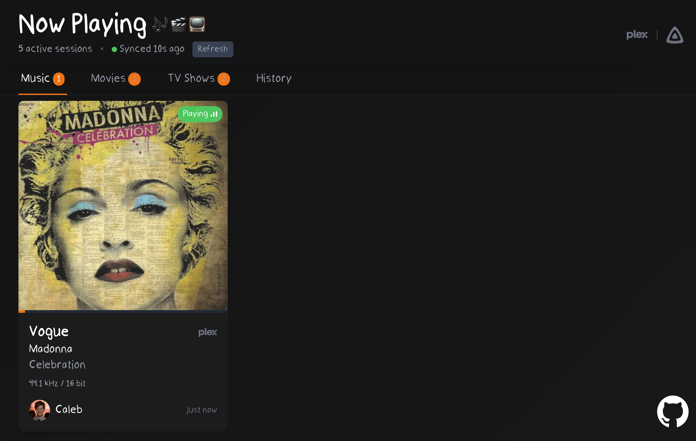
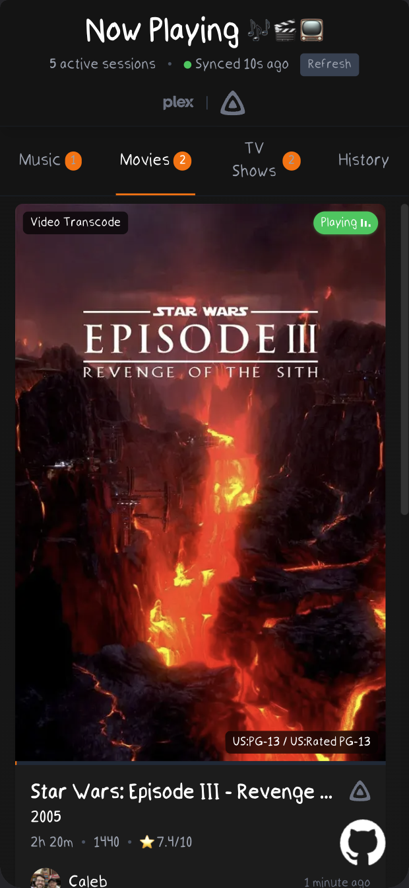
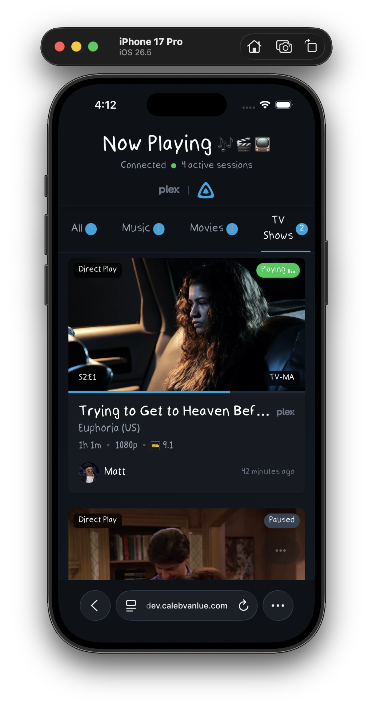
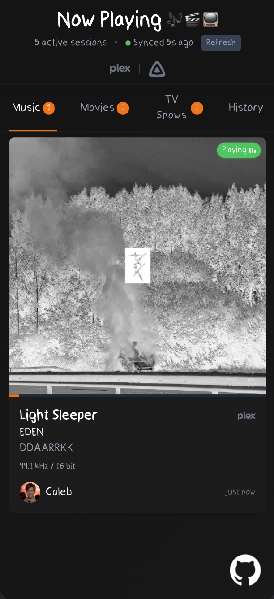
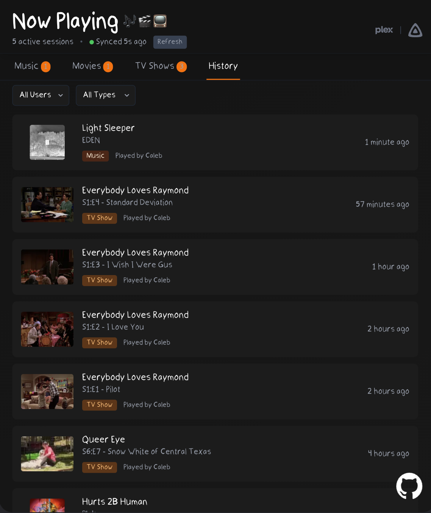

# Now Playing

A sleek, real-time dashboard for monitoring media playback across your self-hosted streaming servers. Supports **Plex** and **Jellyfin** — configure one or both, and sessions and history are merged automatically into a single view.



## Features

- **Multi-service support**: Works with Plex and Jellyfin simultaneously — sessions and history are pooled and sorted together
- **Live updates**: Playback starts, stops, pauses, and seeks show up within seconds, pushed from your media servers over WebSockets
- **Multi-format support**: Tracks movies, TV shows, and music streams
- **Viewing history**: Browse past watch activity with filtering by user and media type
- **Rich media cards**: Progress, quality, transcode status, cast, genres, ratings, and more — expandable detail view per card
- **Responsive design**: Optimized for mobile and desktop with swipe navigation
- **Light on your servers**: One connection per media server, shared by every open dashboard, and closed when nobody's watching
- **Spotify integration**: Direct links to music tracks on Spotify (requires Premium as of Feb 2026)
- **Animated UI**: Smooth transitions and loading states via Framer Motion
- **Docker deployment**: Simple containerized deployment

## Screenshots

| Movies                                | TV Shows                            | Music                               |
| ------------------------------------- | ----------------------------------- | ----------------------------------- |
|  |  |  |

_Mobile Views_

| Movies                                   | TV Shows                               | Music                                  |
| ---------------------------------------- | -------------------------------------- | -------------------------------------- |
|  |  |  |

| History                             |
| ----------------------------------- |
|  |

## Tech Stack

- **Frontend**: Next.js 16, React 19, TypeScript
- **Styling**: Tailwind CSS 4
- **Animations**: Framer Motion
- **State Management**: React Context API
- **Gesture Support**: react-swipeable
- **Icons**: react-icons (Simple Icons)
- **Containerization**: Docker
- **APIs**: Plex API, Jellyfin API, Spotify API
- **Live updates**: Plex and Jellyfin WebSockets upstream, Server-Sent Events to the browser

## Prerequisites

- Node.js 22+ (for its built-in WebSocket client)
- Docker and Docker Compose (for containerized deployment)
- A running Plex and/or Jellyfin server
- Spotify Developer credentials (optional, for music integration)

## Setup and Installation

### Local Development

1. Clone the repository:

   ```bash
   git clone https://github.com/caleb-vanlue/now-playing.git
   cd now-playing
   ```

2. Install dependencies:

   ```bash
   npm install
   ```

3. Copy the example env file and fill in your values:

   ```bash
   cp .env.example .env
   ```

   See [Configuration](#configuration) below for details on each variable.

4. Run the development server:

   ```bash
   npm run dev
   ```

5. Open [http://localhost:3000](http://localhost:3000) in your browser.

### Docker Deployment

1. Ensure Docker and Docker Compose are installed.

2. Copy and configure your environment:

   ```bash
   cp .env.example .env
   # edit .env with your values
   ```

3. Build and run:

   ```bash
   docker-compose up -d
   ```

4. Access the dashboard at [http://localhost:3003](http://localhost:3003).

## How Live Updates Work

```
Plex ──────WebSocket──┐                        ┌── SSE ──> browser
                      ├──> session hub ────────┼── SSE ──> browser
Jellyfin ──WebSocket──┘    (in the server)     └── SSE ──> browser
```

The server keeps **one** WebSocket open to each configured media server and pushes session changes to every open dashboard over a single [Server-Sent Events](https://developer.mozilla.org/docs/Web/API/Server-sent_events) stream (`/api/sessions/stream`). Opening more tabs or devices doesn't add load on your media servers.

- **Jellyfin** pushes the full session list whenever playback changes.
- **Plex** sends a short notification for each playback change. The dashboard updates the session in place, and only fetches full details when a new session or item starts. It also re-checks everything every 5 minutes.
- Each WebSocket is seeded with one regular API request when it connects, since neither server sends the current state up front.
- Connections open when the first dashboard does, and close about 2 minutes after the last one does.
- Progress bars count forward in the browser, so routine position reports aren't re-sent unless they disagree by more than 2 seconds.

Everything else (history, artwork, related items, lyrics, Spotify) uses regular HTTP requests.

**Fallbacks.** If a media server's WebSocket drops, the server polls that media server until it reconnects. If the browser can't hold the event stream open, the dashboard polls instead and retries the stream every few minutes. The header shows the current mode:

| Indicator    | Meaning                                                  |
| ------------ | -------------------------------------------------------- |
| Live         | Updates are pushed as they happen                        |
| Connected    | The live stream is unavailable; refreshing periodically  |
| Disconnected | No media server could be reached; retrying automatically |

## Configuration

Copy `.env.example` to `.env`. At least one of Plex or Jellyfin must be configured — both can be active at the same time.

### Environment Variables

| Variable                    | Description                                          | Required          |
| --------------------------- | ---------------------------------------------------- | ----------------- |
| `PLEX_URL`                  | Full URL of your Plex server (with port)             | If using Plex     |
| `PLEX_TOKEN`                | Plex authentication token                            | If using Plex     |
| `JELLYFIN_URL`              | Full URL of your Jellyfin server (with port)         | If using Jellyfin |
| `JELLYFIN_API_KEY`          | Jellyfin API key (admin privileges required)         | If using Jellyfin |
| `SPOTIFY_CLIENT_ID`         | Spotify Developer app Client ID                      | Optional          |
| `SPOTIFY_CLIENT_SECRET`     | Spotify Developer app Client Secret                  | Optional          |
| `NEXT_PUBLIC_FETCH_TIMEOUT` | Upstream API request timeout in ms                   | Optional (8000)   |
| `USERNAME_MAP`              | Display-name overrides, e.g. `alice:Alice,bob99:Bob` | Optional          |
| `STATUS_KEY`                | Enables the private `/status` page (see below)       | Optional          |

### Obtaining a Plex Token

1. Open Plex Web and navigate to any media item
2. Click ⋮ → "Get Info" → "View XML"
3. Copy the `X-Plex-Token` value from the URL

Full instructions: [support.plex.tv/articles/204059436](https://support.plex.tv/articles/204059436)

### Obtaining a Jellyfin API Key

1. Open the Jellyfin admin dashboard
2. Go to **Administration → API Keys → +**
3. Give it a name (e.g. "Now Playing") and save
4. The key needs admin-level access to list all users' playback history

### Status Page

Set `STATUS_KEY` to a long random value (e.g. `openssl rand -hex 32`) to enable `/status`, a private page for the instance. Without the key, `/status` and `/api/status` return 404. The page shows:

- Each media server's connection: live WebSocket, polling, or unreachable, with the last error
- Who is watching the dashboard right now (location, browser, device, IP, live or polling)
- Peak viewers, unique visitors (24 h / 7 d) and connections in the last 24 h
- What's playing, the session hub's state, process memory, and a recent event log

After you enter the key, a signed cookie keeps you signed in for 30 days. Changing `STATUS_KEY` signs everyone out. Scripts can call `/api/status` with `Authorization: Bearer <key>`.

Stats are kept in memory and reset when the server restarts. Location comes from Cloudflare: country works out of the box, and city and region need **Rules → Managed Transforms → Add visitor location headers** turned on in the Cloudflare dashboard. Visitors on your LAN, localhost, or a CGNAT range like Tailscale don't go through Cloudflare, so they show as **Local network**.

### Setting Up Spotify Integration

> **Note:** As of Feb 2026 this feature requires a Spotify Premium account.

1. Create an app at [developer.spotify.com/dashboard](https://developer.spotify.com/dashboard)
2. Copy the Client ID and Client Secret into your `.env`

## API Endpoints

| Endpoint                  | Description                                                            |
| ------------------------- | ---------------------------------------------------------------------- |
| `/api/sessions/stream`    | Live active sessions from all servers (Server-Sent Events)             |
| `/api/plex/sessions`      | Active Plex sessions (polling fallback)                                |
| `/api/plex/history`       | Plex viewing history                                                   |
| `/api/plex/thumbnail`     | Proxied Plex media thumbnails                                          |
| `/api/jellyfin/sessions`  | Active Jellyfin sessions, enriched with item detail (polling fallback) |
| `/api/jellyfin/history`   | Jellyfin playback history (all users)                                  |
| `/api/jellyfin/thumbnail` | Proxied Jellyfin media thumbnails                                      |
| `/api/spotify/search`     | Spotify track search                                                   |
| `/api/status`             | Instance health and viewer stats (requires `STATUS_KEY`)               |

## Acknowledgments

- [Plex](https://www.plex.tv) for their media server platform
- [Jellyfin](https://jellyfin.org) for the open-source media server
- [Spotify](https://developer.spotify.com) for their music API
- All the open-source libraries that make this possible
